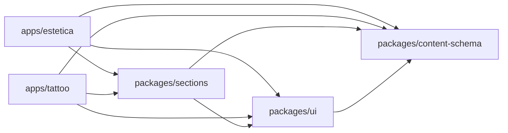
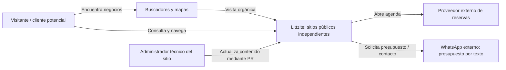
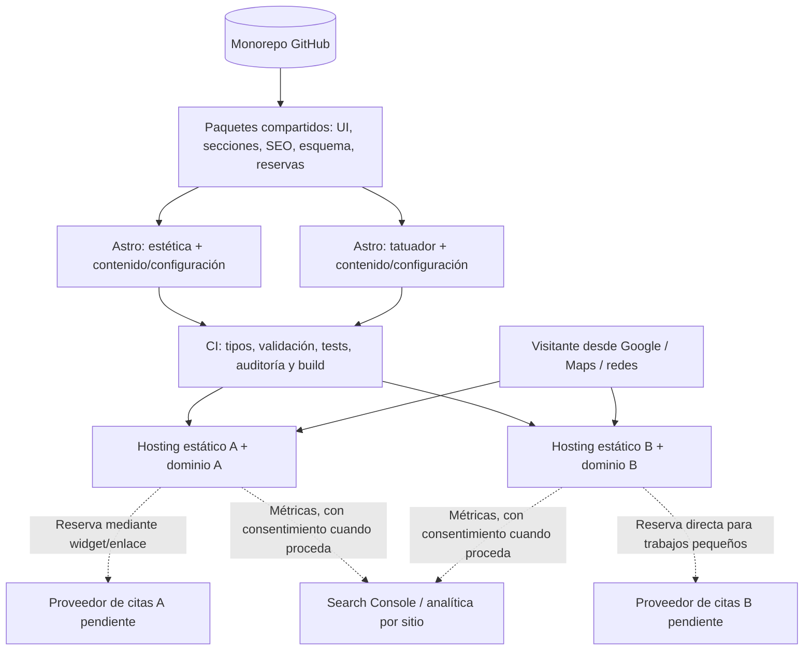
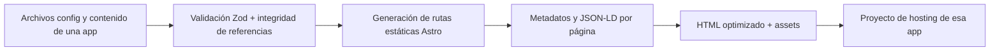
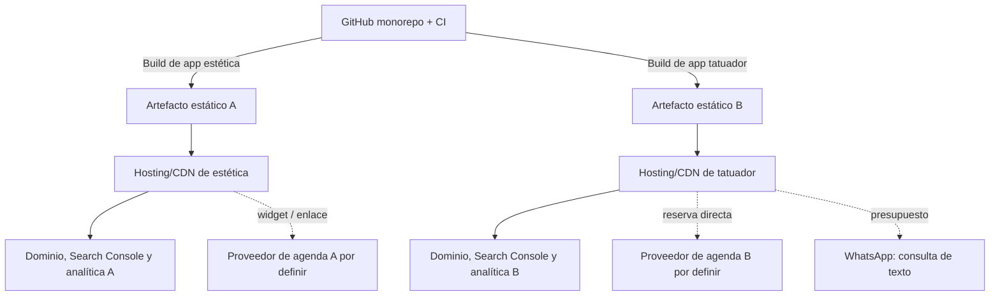

# Arquitectura lógica y despliegue — v0.5

## Monorepo objetivo (arquitectura conceptual)

El árbol combina componentes implementados con **módulos conceptuales**. A partir del prototipo visual PR-03 existen `apps/{estetica,tattoo}` y `packages/{content-schema,ui,sections}`; solamente `seo` y `booking` permanecen previstos para cuando haya integraciones y destinos aprobados.

```text
Littzite/
├── apps/
│   ├── estetica/               # Entrypoints Astro, contenido, configuración e identidad
│   └── tattoo/                 # Entrypoints Astro, contenido, configuración e identidad
├── packages/
│   ├── content-schema/         # Zod/types: sitio, páginas, secciones y servicios
│   ├── ui/                     # Primitivos accesibles y tokens semánticos
│   ├── sections/               # Hero, galerías, catálogo, testimonios, FAQ, CTA
│   ├── seo/                    # Head, canonical, JSON-LD, sitemap/utilidades
│   └── booking/                # Contrato y adaptadores de proveedores
├── docs/                       # Esta documentación + ADRs
├── .github/workflows/          # CI: hoy verifica y compila ambas apps en cada PR
├── pnpm-workspace.yaml
└── pnpm-lock.yaml
```

**Regla de dependencias:** `apps/* -> packages/*`. Nunca `apps/estetica -> apps/tattoo` ni dependencias circulares entre paquetes. Evitar separar en paquetes elementos que todavía no tengan una interfaz estable; la estructura podrá simplificarse tras una prueba de implementación.

### Grafo implementado en PR-03



`content-schema` contiene los contratos Zod de sitio, páginas, servicios, secciones y destinos, más validación de referencias dentro de `SiteContent`. `ui` expone layout, cabecera, pie, contenedor, enlaces y tokens CSS; `sections` expone `LandingHero` y `FeatureGrid`, usados por ambas apps y dependientes únicamente de APIs públicas de `ui` y `content-schema`. El árbol conceptual aún incluye `seo` y `booking`, **no creados** hasta necesitar contratos implementados. No hay ciclos entre paquetes ni imports entre aplicaciones. `scripts/check-boundaries.mjs` comprueba manifests e imports literales en CI.

## Diagrama de contexto (C4 nivel 1, simplificado)



Los negocios controlan las cuentas de sus proveedores y validan la exactitud de su información pública. Un repositorio compartido **no** implica almacenamiento compartido de clientes o reservas.

## Diagrama de contenedores (C4 nivel 2, simplificado)



Los proveedores pueden coincidir o ser distintos; **no se seleccionó ninguno**. El flujo de presupuesto del tatuador sale a **WhatsApp** mediante enlace construido desde `ContactConfig` y `QuoteTarget`: solo texto en v1. Número comercial y mensaje inicial, pendientes de validar antes de publicar.

## Límites de responsabilidad

| Límite | Decide | No hace |
| --- | --- | --- |
| `content-schema` | Tipos y validaciones de configuración/contenido | Renderizado, HTTP, credenciales |
| `ui` | Botones, controles, patrones accesibles, tokens | Decisiones de negocio o llamadas a proveedores |
| `sections` | Composición de bloques reutilizables con props tipadas | Consultar contenido global de una app |
| `seo` | Metadatos, URL canonical, schema, sitemap helpers | Inventar reseñas o localidades no verificadas |
| `booking` | Resolver acciones `direct-booking`, targets y adaptadores soportados | Crear agenda local, decidir política de señas o fingir una API de reserva universal |
| `content-schema` + resolver de acciones | Validar `ServiceAction[]` y relaciones con destinos de reserva/presupuesto; WhatsApp obtiene el único número de `ContactConfig` | Hardcodear flujos por identidad de app ni duplicar números comerciales |
| `apps/*` | Identidad, contenido, orden de páginas, proveedores y deploy | Reimplementar lógica compartida |

## Ciclo de contenido



## Independencia operativa

- Cada aplicación define dominio/canonical, sitemap, iconos, imágenes sociales, cuenta de reservas y analítica independientes.
- D-09: ambas apps publican contenido en `es-AR`, sin prefijo idiomático; el contrato `SiteConfig.defaultLocale` es la fuente de verdad para el idioma del documento, metadatos y formatos. Los paquetes compartidos no implementan un router de idiomas ni catálogos de traducción en v1.
- Comparten librerías, no sesiones ni secretos. **CI actual de PR-01:** siempre ejecuta `check`, `build` y `test` para ambas apps en cada PR; por lo tanto los cambios comunes quedan verificados en ambas. **Objetivo posterior:** despliegues independientes y selectivos por rutas afectadas, todavía no implementados.
- No se almacena un registro local de reservas en v1; la fuente de verdad es el proveedor elegido.
- Cada integración externa incluye fallback a enlace externo y una política ante indisponibilidad.

## Despliegue independiente (topología conceptual)



El proveedor de hosting está **propuesto**, no confirmado. Para el contenido público se privilegia salida estática. Aislar variables de entorno y cuentas por proyecto. En previews, impedir indexación por controles de acceso cuando estén disponibles; `noindex` no reemplaza un control de acceso.

## Reglas para dependencias entre paquetes

El grafo implementado se muestra arriba y comprende dos apps y tres paquetes realmente consumidos: `content-schema`, `ui` y `sections`. Los futuros paquetes solo se incorporarán cuando tengan consumidores concretos. Reglas invariantes: `apps/*` puede importar paquetes públicos; no hay importaciones cruzadas entre apps, ni dependencias inversas desde packages hacia apps, ni ciclos entre paquetes. No extraer una librería por cada componente antes de demostrar reutilización. **Un contrato compartido y su implementación tienen un solo propietario.**

## PR-05: galería específica de Juanjo

La composición de Juanjo sigue utilizando `ui` y `sections` públicos. El portfolio de imágenes con `astro:assets` pertenece por ahora a `apps/tattoo`, con un único consumidor y sin nuevo paquete compartido. Los datos editoriales y estilos permanecen dentro de la app; las imágenes auténticas se importarán estáticamente cuando se entreguen los originales. Este cambio no modifica el grafo de dependencias de paquetes. Ver [ADR-011](adr/011-tattoo-portfolio-local.md).
