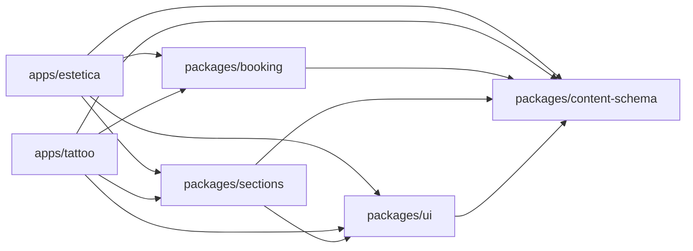
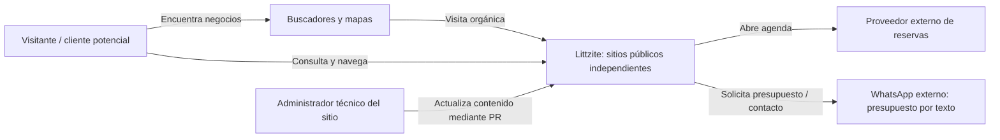
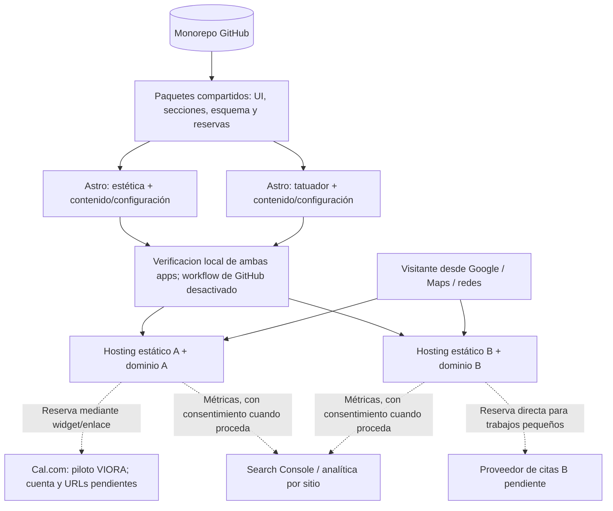
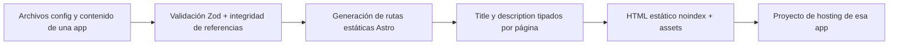
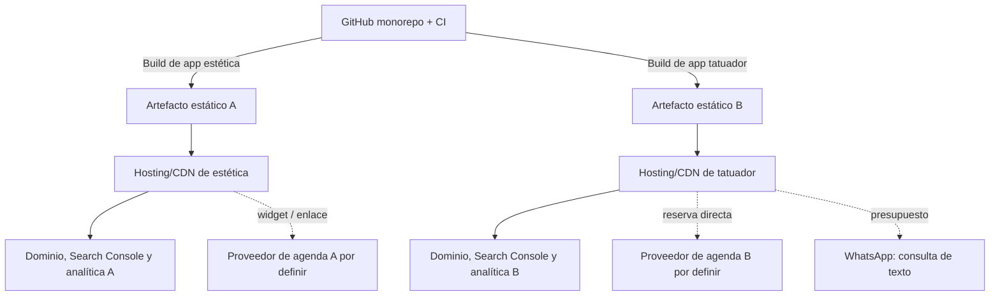

# Arquitectura lógica y despliegue — v0.5

## Monorepo objetivo (arquitectura conceptual)

El árbol combina componentes implementados con **módulos conceptuales**. `apps/{estetica,tattoo}` consume contratos de `content-schema`, `ui`, `sections` y la fundación headless `booking`. El contrato editorial de metadata pertenece a `content-schema`; `ui` renderiza el head común y cada app define sus valores. No se crea un paquete SEO mientras esta responsabilidad sea solo validación y render común.

```text
Littzite/
├── apps/
│   ├── estetica/               # Entrypoints Astro, contenido, configuración e identidad
│   └── tattoo/                 # Entrypoints Astro, contenido, configuración e identidad
├── packages/
│   ├── content-schema/         # Zod/types: sitio, páginas, secciones y servicios
│   ├── ui/                     # Primitivos accesibles y tokens semánticos
│   ├── sections/               # Hero, galerías, catálogo, testimonios, FAQ, CTA
│   └── booking/                # Contrato y adaptadores de proveedores
├── docs/                       # Esta documentación + ADRs
├── .github/workflows/          # Workflows presentes, CI desactivada por el propietario
├── pnpm-workspace.yaml
└── pnpm-lock.yaml
```

**Regla de dependencias:** `apps/* -> packages/*`. Nunca `apps/estetica -> apps/tattoo` ni dependencias circulares entre paquetes. Evitar separar en paquetes elementos que todavía no tengan una interfaz estable; la estructura podrá simplificarse tras una prueba de implementación.

### Grafo implementado en PR-03



`content-schema` contiene los contratos Zod de sitio, páginas, servicios, secciones y destinos, más validación de referencias dentro de `SiteContent`. `ui` expone layout, cabecera, pie, contenedor, enlaces y tokens CSS; `sections` expone `LandingHero` y `FeatureGrid`, usados por ambas apps y dependientes únicamente de APIs públicas de `ui` y `content-schema`. `booking` depende solo de `content-schema`; valida proveedores soportados y resuelve acciones `direct-booking` mediante una policy compartida, sin Astro, DOM, red ni estado. Su registry cerrado soporta solo `cal-com`. Las apps configuran; la UI presenta; el proveedor controla duración operacional, disponibilidad y citas. Ninguna app llama aún al resolver. No hay ciclos entre paquetes ni imports entre aplicaciones. `scripts/check-boundaries.mjs` comprueba manifests, imports con AST de TypeScript (incluido frontmatter Astro), CSS @import y ciclos **localmente**; GitHub Actions está desactivado por decisión del propietario.

## Diagrama de contexto (C4 nivel 1, simplificado)



Los negocios controlan las cuentas de sus proveedores y validan la exactitud de su información pública. Un repositorio compartido **no** implica almacenamiento compartido de clientes o reservas.

## Diagrama de contenedores (C4 nivel 2, simplificado)



Cal.com fue seleccionado **solo para un piloto futuro de VIORA**, hoy en standby: la profesional todavía no configuró cuenta, eventos ni URLs. El proveedor de tatuajes sigue pendiente; su presupuesto por WhatsApp será texto directo, sin número ni mensaje aprobado todavía. `ContactConfig`, `BookingTarget` y `QuoteTarget` son contratos, no integraciones activas.

## Límites de responsabilidad

| Límite | Decide | No hace |
| --- | --- | --- |
| `content-schema` | Tipos y validaciones de configuración/contenido | Renderizado, HTTP, credenciales |
| `ui` | Botones, controles, patrones accesibles, tokens | Decisiones de negocio o llamadas a proveedores |
| `sections` | Composición de bloques reutilizables con props tipadas | Consultar contenido global de una app |
| `booking` | Registry cerrado, política fail-closed de URLs `BookingTarget` y resolución pura de una acción `direct-booking` | Resolver otras acciones, crear agenda local, decidir política de señas o fingir una API de reserva universal |
| `content-schema` | Validar `ServiceAction[]` y relaciones con destinos de reserva/presupuesto; WhatsApp obtiene el único número de `ContactConfig` | Hardcodear flujos por identidad de app ni duplicar números comerciales |
| `apps/*` | Identidad, contenido, orden de páginas, proveedores y deploy | Reimplementar lógica compartida |

## Ciclo de contenido



## Independencia operativa

- Cada aplicación **deberá definir** dominio/canonical, sitemap, iconos, imágenes sociales, cuenta de reservas y analítica independientes antes del lanzamiento; todavía no hay despliegue productivo ni esas integraciones.
- D-09: ambas apps publican contenido en `es-AR`, sin prefijo idiomático; el contrato `SiteConfig.defaultLocale` es la fuente de verdad para el idioma del documento, metadatos y formatos. Los paquetes compartidos no implementan un router de idiomas ni catálogos de traducción en v1.
- El preview implementa `title` y `description` tipados en `content-schema`, renderizados por `ui` y provistos por cada app. Canonical, sitemap, robots de producción, JSON-LD, Open Graph, dominios y Search Console siguen pendientes; ambas apps conservan `noindex`.
- Comparten librerias, no sesiones ni secretos. Los workflows de GitHub Actions permanecen desactivados por decision del propietario; los seis gates deben ejecutarse localmente antes de integrar cambios. Los despliegues independientes y selectivos por rutas siguen sin implementarse.
- No se almacena un registro local de reservas en v1; la fuente de verdad es el proveedor elegido.
- Cada integración externa incluye fallback a enlace externo y una política ante indisponibilidad.

## Despliegue independiente (topología conceptual)



El proveedor de hosting está **propuesto**, no confirmado. Para el contenido público se privilegia salida estática. Aislar variables de entorno y cuentas por proyecto. En previews, impedir indexación por controles de acceso cuando estén disponibles; `noindex` no reemplaza un control de acceso.

## Reglas para dependencias entre paquetes

El grafo implementado se muestra arriba y comprende dos apps y cuatro paquetes realmente consumidos: `content-schema`, `ui`, `sections` y `booking`. El checker aplica la allowlist `packages/booking -> packages/content-schema`; bloquea dependencias de booking hacia cualquier otro package workspace, incluidas futuras incorporaciones, así como la regla general que impide dependencias de packages hacia apps. Reglas invariantes: `apps/*` puede importar paquetes públicos; no hay importaciones cruzadas entre apps ni ciclos entre paquetes. No extraer una librería por cada componente antes de demostrar reutilización. **Un contrato compartido y su implementación tienen un solo propietario.**

## PR-05: galería específica de Juanjo

La composición de Juanjo sigue utilizando `ui` y `sections` públicos. El portfolio de imágenes con `astro:assets` pertenece por ahora a `apps/tattoo`, con un único consumidor y sin nuevo paquete compartido. Los datos editoriales y estilos permanecen dentro de la app; las imágenes auténticas se importarán estáticamente cuando se entreguen los originales. Este cambio no modifica el grafo de dependencias de paquetes. Ver [ADR-011](adr/011-tattoo-portfolio-local.md).

## PR-06: catalogo informativo local de VIORA

El catalogo se implementa dentro de `apps/estetica`: `site.config.ts` es la fuente de fichas y orden; `ServiceCatalog.astro` renderiza las referencias `service-list`; la ruta estatica `[slug].astro` deriva sus paths de `siteContent.services`. Esto no modifica el grafo de paquetes ni introduce un consumidor compartido nuevo. Cada detalle conserva `es-AR`, layout compartido y `noindex`. Las fichas sin acciones no requieren ni invocan proveedor de reservas. D-02A y D-01C siguen bloqueando la activacion de turnos reales.


## PR-07: layout de aplicacion para VIORA

`apps/estetica/src/layouts/VioraSiteLayout.astro` compone `BaseLayout`, `SiteHeader` y `SiteFooter` públicos y concentra la navegación absoluta desde cualquier ruta, logos oficiales, hoja `viora.css`, locale `es-AR` y `noindex`. La portada y los detalles conservan sus cuerpos distintos y consumen el mismo marco. El catálogo dispone de estilos locales explícitos y ya no depende de clases privadas de sections ni de importar LandingHero. No cambia el grafo de paquetes ni el layout de Juanjo.
