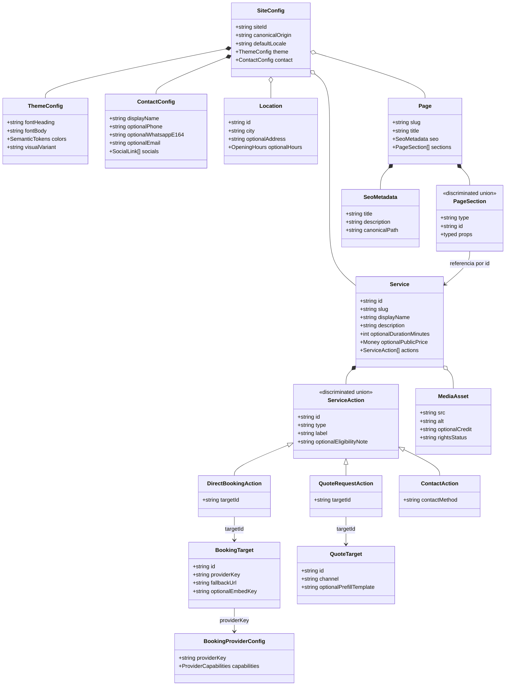
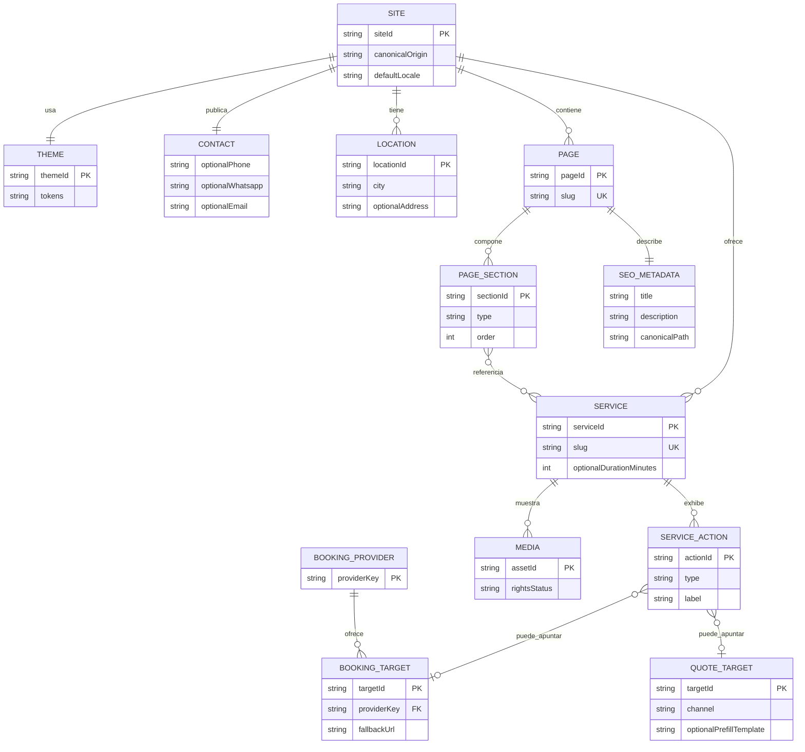

# Modelo de dominio, clases y ERE conceptual — v0.5

**Alcance:** modelos de contenido estático validado en build. **No** son tablas SQL, no hay backend propio, CRM, historia clínica ni motor de turnos. Los diagramas son diseño propuesto; todavía no existen clases o contratos implementados.

## Decisiones confirmadas que modelamos

- **Estética:** una profesional y servicios con duración fija. El valor en minutos por tratamiento, horarios, local y proveedor son datos aún no confirmados.
- **Tatuador:** un trabajo pequeño se puede reservar directamente; un trabajo grande requiere presupuesto previo. No está definido el umbral de tamaño ni que el tatuador trabaje solo.
- **D-04:** presupuestos para trabajos grandes por WhatsApp directo, inicialmente solo texto. No se cargan archivos en Littzite. Número comercial real y texto inicial, pendientes de validar.
- **D-09:** español de Argentina (`es-AR`) como único idioma inicial en ambas apps. `SiteConfig.defaultLocale` conserva un único origen validado para `html lang`, metadatos y formatos.
- **Señas, pagos, reprogramación y cancelaciones:** pendiente para ambos negocios.

## Separar servicio, acción de conversión y proveedor

Un mismo servicio/página puede mostrar **más de un recorrido** (por ejemplo, reservar trabajo pequeño y presupuestar trabajo grande). El antiguo `Service.bookingMode` único era insuficiente para ese escenario y queda reemplazado por `ServiceAction[]`, una unión discriminada validada con Zod. La acción determina el **recorrido comercial**; el target determina **adónde se deriva**; el adaptador determina **cómo representar un proveedor de agenda**. Son responsabilidades independientes.

### Diagrama de clases conceptual



La herencia Mermaid representa una **unión discriminada**, no clases base orientadas a objetos que haya que programar. `PageSection` incluye `hero`, `serviceGrid`, `gallery`, `testimonials`, `faq`, `serviceActions` y `contact`, con props tipadas por variante. Los componentes compartidos reciben datos ya validados; no leen la configuración de una app específica.

### ERE conceptual del contenido



La relación condicional entre una acción y su destino depende del **discriminante**: la acción directa requiere `BookingTarget`, la de presupuesto requiere `QuoteTarget` y la de contacto utiliza un canal disponible en `ContactConfig`. Se comprueba en Zod y en tests de integridad; el ERE no implica claves foráneas SQL reales.

## Contratos TypeScript ilustrativos

```ts
type ServiceAction =
  | {
      id: string;
      type: 'direct-booking';
      label: string;
      eligibilityNote?: string;
      targetId: string; // referencia a BookingTarget validada en build
    }
  | {
      id: string;
      type: 'quote-request';
      label: string;
      eligibilityNote?: string;
      targetId: string; // referencia a QuoteTarget validada en build
    }
  | {
      id: string;
      type: 'contact';
      label: string;
      contactMethod: 'whatsapp' | 'phone' | 'email';
    };

type Service = {
  id: string;
  slug: string;
  displayName: string;
  description: string;
  durationMinutes?: number;
  publicPrice?: { amount: number; currency: 'ARS' };
  actions: ServiceAction[];
};

type BookingTarget = {
  id: string;
  providerKey: string;  // se configura por sitio, no en el componente visual
  fallbackUrl: string; // HTTPS, host aprobado y propiedad verificada
  embedKey?: string;   // solo si el adaptador ofrece embed y se valida el valor
};

type QuoteTarget = {
  id: string;
  channel: 'whatsapp'; // canal confirmado para el primer tatuador
  prefillTemplate?: string; // texto editorial aprobado, sin datos personales
  // El número E.164 verificado se lee de ContactConfig.whatsapp, sin duplicarlo aquí
};
```

En v1, un `QuoteTarget` de WhatsApp genera `https://wa.me/<numero>?text=<texto-codificado>` usando el único número E.164 aprobado en `ContactConfig`. Se codifica el mensaje con `encodeURIComponent`, se permite opcionalmente interpolar únicamente datos públicos como el nombre del servicio y no se introducen datos personales en la URL. El visitante redacta y envía el mensaje en WhatsApp; el clic **no prueba** que lo haya enviado. La web no recopila respuestas ni archivos.

`SiteConfig.defaultLocale` se validará inicialmente para aceptar solo `es-AR`. No duplicar el locale en los componentes ni derivarlo del nombre del cliente. No agregar modelos de traducción o relaciones `PageTranslation` al ERE conceptual hasta que exista un requerimiento de otro idioma. Slugs y URLs serán simples, sin prefijo de idioma.

Los tipos son **ilustrativos**, no código productivo ni licencia para asumir que todos los proveedores admiten embeds. Al implementar, los esquemas Zod serán la única fuente de verdad para inferir los tipos y validar referencias cruzadas.

## Invariantes verificables

1. Slugs únicos por app y colección; todas las referencias desde secciones y acciones existen en su propio sitio.
2. Un servicio puede tener varias acciones de distintos tipos, sin copiar la ficha ni condicionar por `siteId`.
3. Un `direct-booking` tiene exclusivamente un destino `BookingTarget` válido; un `quote-request`, un `QuoteTarget` de WhatsApp aprobado con número comercial real; `contact` exige un método existente en `ContactConfig`. No se deduce disponibilidad ni cita confirmada desde el frontend.
4. Para la estética, cada tratamiento publicable con reserva directa exige duración positiva **validada por el negocio** y una agenda real configurada antes del lanzamiento. No inventar minutos en ejemplos públicos.
5. Para tatuajes, no imponer automáticamente un umbral en centímetros, precio o duración para separar pequeños y grandes hasta que el artista lo defina. La clasificación puede ser editorial y la acción se presenta con una nota de elegibilidad aprobada.
6. `canonicalOrigin`, datos estructurados, contacto y assets corresponden al sitio correcto; derechos de imagen verificados fuera del simple booleano de configuración.
7. Las cuentas, secretos, citas, datos personales de consultas y pagos no forman parte del modelo de contenido público. Un cambio que requiera almacenamiento privado dispara nueva ADR y revisión de seguridad.
