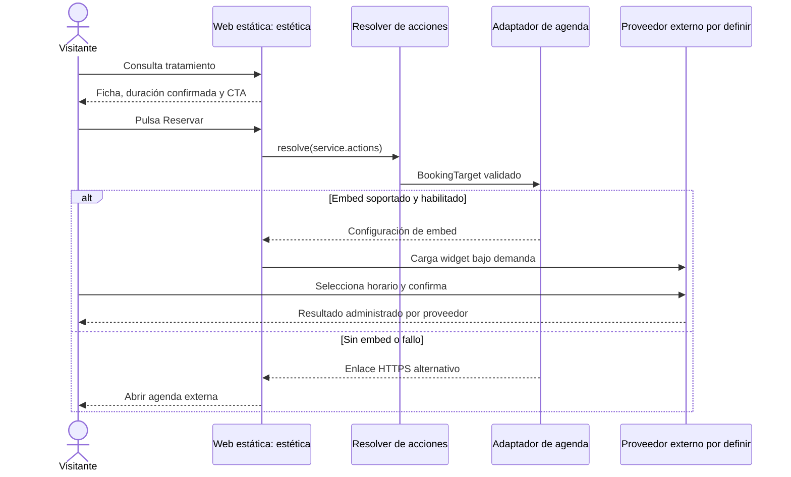
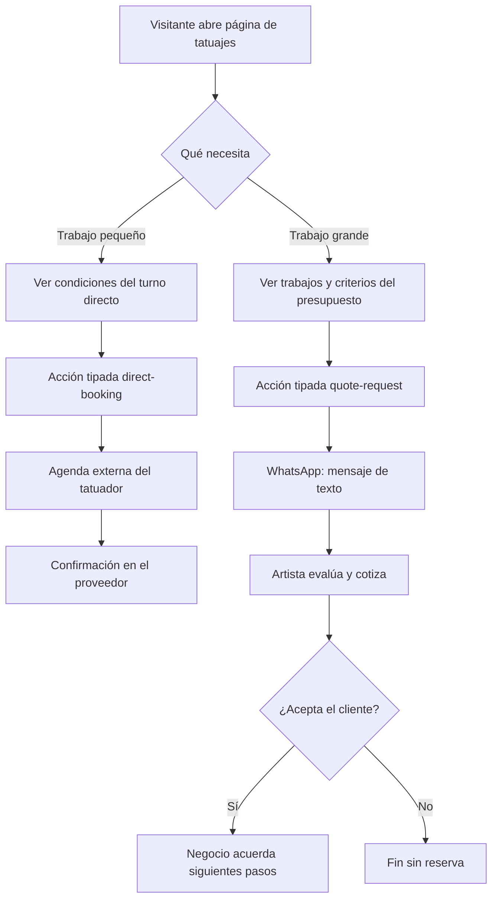
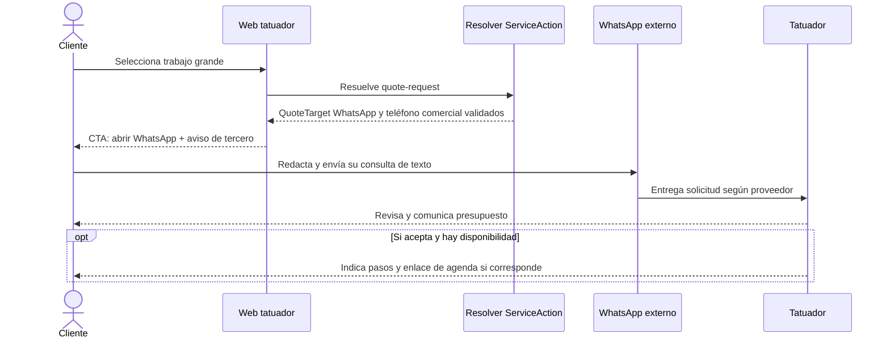
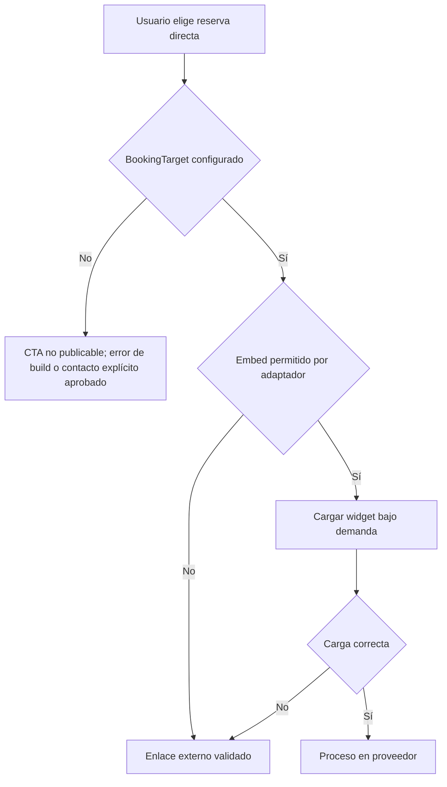
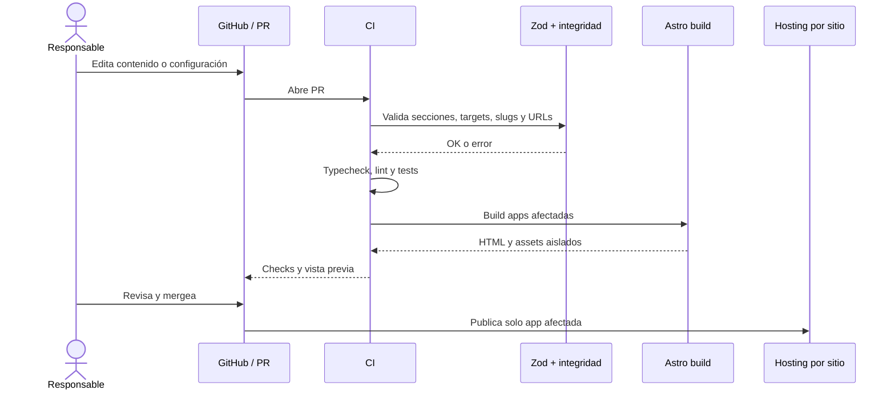
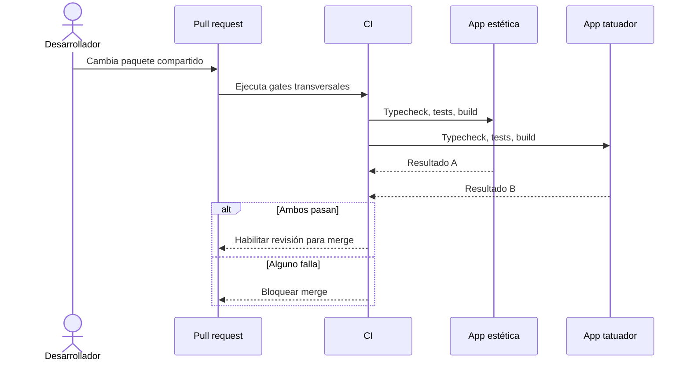

# Flujos y secuencias — v0.4

Las siguientes secuencias describen **flujos confirmados y contratos previstos**, no integraciones ya implementadas. El proveedor de reservas y las cuentas por negocio todavía no están elegidos. El canal de presupuestos de tatuajes grandes **sí** fue elegido: WhatsApp directo, inicialmente solo texto, sin formulario ni archivos propios.

## Estética: reserva de un tratamiento de duración fija

**Invariante:** una sola profesional en la estética; el proveedor conserva toda la disponibilidad y los registros de citas. La duración real de cada tratamiento debe validarse antes de publicarlo. No suponer automáticamente ausencia de señas ni reglas de cancelación.

## Tatuador: misma ficha con dos recorridos

**No asumimos:** umbral en centímetros, si los trabajos pequeños tienen siempre duración fija, cuántos tatuadores trabajan, qué datos/archivos recibe el presupuesto, ni si existe seña. La reserva directa se restringe a la oferta que el artista apruebe. La solicitud de presupuesto **no crea una cita**.

## Secuencia: presupuesto de trabajo grande

El canal está definido por D-04 como WhatsApp de texto. Si el teléfono comercial o el texto editorial no están validados, **no se publica un enlace ficticio ni un formulario propio**. No existe subida de imágenes desde Littzite ni se registra el contenido de los mensajes. El envío efectivo no puede deducirse del clic.

## Fallo del widget y retorno seguro

El evento visual del widget es **solo telemetría no autoritativa**, no prueba de cita ni de pago. Si después se requieren métricas de citas confirmadas, deberá evaluarse un webhook autenticado, deduplicación, retención mínima y una ADR nueva.

## Secuencia: editar y publicar contenido

## Secuencia: un cambio transversal comprueba ambos sitios

