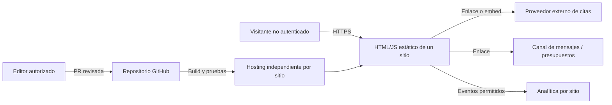

# Modelo inicial de amenazas y límites de confianza

**Alcance:** sitios públicos estáticos y sus servicios externos. Es un análisis preventivo para v1, no una afirmación de que una integración ya existe ni un dictamen de cumplimiento.

## Límites de confianza

No existen en v1 servidor de aplicación, base de datos, cuentas de visitantes ni repositorio central de reservas. Datos ingresados en un calendario externo quedan bajo las condiciones de su proveedor y del negocio.

## Amenazas y controles

| Superficie | Riesgo | Control de diseño | Verificación |
|---|---|---|---|
| Configuración y URLs | Destino malicioso o iframe arbitrario | URL HTTPS validada, allowlist de proveedores, fallback seguro | Tests de esquema y URL |
| Scripts/iframes terceros | Ejecución no controlada, privacidad | Cargar bajo demanda, CSP evaluada con proveedor real, inventario de terceros | Auditoría de red y CSP |
| Mensajes de embeds | Mensajes falsificados | Validar `origin`, formato y tipo; no usar como confirmación de pago/reserva | Tests con mensajes inválidos |
| Repo público / CI | Exposición de secretos | No poner credenciales en Git ni variables públicas; permisos mínimos y revisión de logs | Escaneo de secretos y PR review |
| Presupuestos externos | Filtración, spam, referencias fotográficas sensibles o exceso de datos | Elegir canal bajo D-04; política de privacidad, mínimo necesario y permisos apropiados; no alojar archivos privados en la web estática | Prueba del recorrido aprobado y revisión de campos |
| Fotos/testimonios | Uso sin derechos o identificación no consentida | Aprobación del cliente, fuente y licencias verificadas, retirada documentada | Checklist editorial |
| Previews y staging | Indexación accidental o filtración de contenido | Previews no indexables; acceso restringido si no son públicas | Robots, meta y acceso |
| Dependencias / template | Vulnerabilidades, licencia inadecuada | Auditoría selectiva, lockfile, actualización controlada, atribuciones requeridas | Revisión de dependencias/licencias |
| Configuración cruzada | Teléfono, cuenta de calendario o tracking del cliente equivocado | Config aislada por app, validación de dominios, builds y pruebas cruzadas | E2E de ambas apps |

## Exclusiones que disparan rediseño

No recibir ni almacenar historias clínicas, contraindicaciones, fotos privadas íntimas, documentos de identidad o detalles de salud en esta versión. Si cualquiera de los negocios necesita recolectarlos, detener el desarrollo de ese flujo para decidir minimización de datos, proveedor autorizado, retención, seguridad y requisitos legales con asesoramiento apropiado.

**No confundir** el evento visual `booking_widget_event` con `provider_confirmed_booking`. Para confirmación fiable en una fase futura: webhook verificado, idempotencia y una base de datos mínima justificada por nueva ADR.
